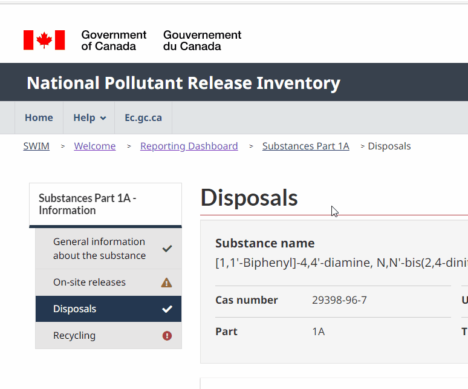
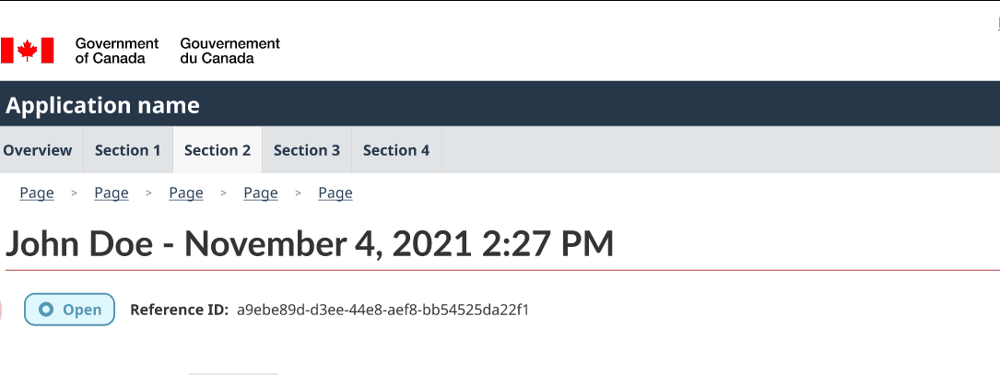
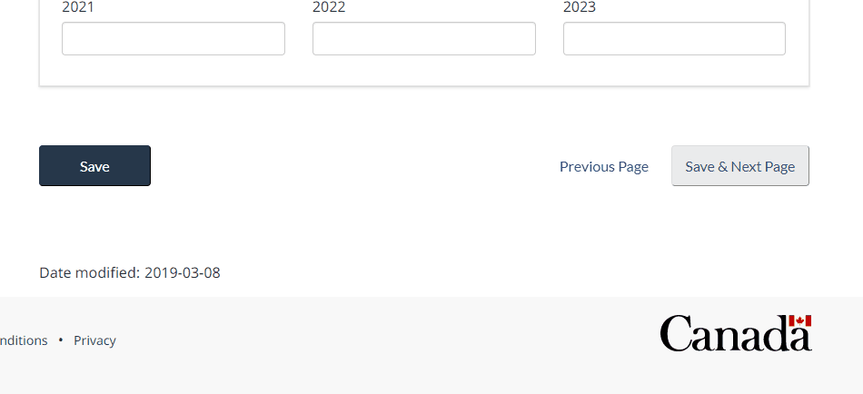
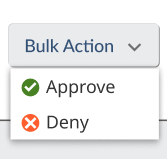
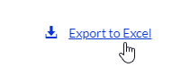
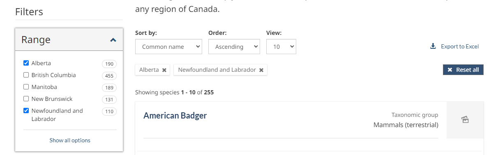
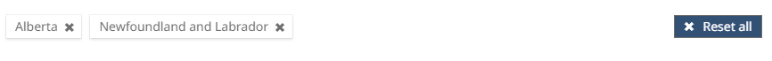
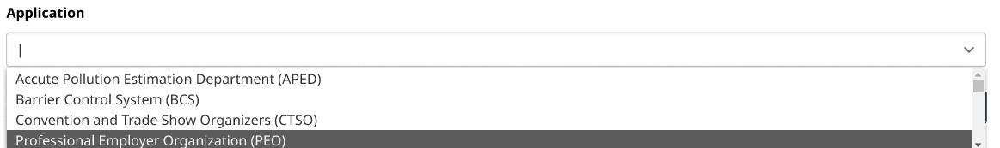
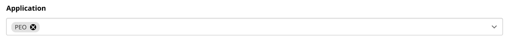

| **Blazor UI Components** Suggestions |  |
|--------------------------------------|--------------------------------------------------------------------------|
| *Last updated:* **June 1, 2022**     |                                                                          |

<!-- TOC -->

- [Overview](#overview)
    - [Updates](#updates)
        - [2022 -06-01](#2022--06-01)
    - [Note on GIFs](#note-on-gifs)
    - [Implemented](#implemented)
- [Components](#components)
    - [Sticky components](#sticky-components)
        - [Sticky Side Menu](#sticky-side-menu)
        - [Sticky Table of Contents](#sticky-table-of-contents)
        - [Sticky Header](#sticky-header)
        - [Sticky Footer](#sticky-footer)
    - [Cards](#cards)
    - [Dropdowns / Menus](#dropdowns--menus)
    - [Export to Excel/CSV](#export-to-excelcsv)
    - [Faceted Search](#faceted-search)
        - [Faceted Filter Menu](#faceted-filter-menu)
        - [Selected Filter Option (Pills)](#selected-filter-option-pills)
    - [Multi Select](#multi-select)

<!-- /TOC -->

# Overview

This is a list of commonly used components. We will be adding to this
list as new ideas come up. You can find a log of our updates to this
file in the section below.

For comments or questions, please leave a comment in this document or
[contact the UX
team](mailto:experienceutilisateur-userexperience@ec.gc.ca).

## Updates

### 2022-06-01

-   Initial version of the document

## Note on GIFs

Some of the images in this document are GIFs, but for some reason they
are not animated by either Word Web or Word Desktop apps. All assets
used in this document are also stored here:
[Assets](https://007gc.sharepoint.com/:f:/s/BeSD-SADSAI-AS-UXTeam/EgAZxjy8CtdOiIIwIJDIiBsB64wMvV_p5VqjeraT8B6T6g?e=aba4Ys)

## Implemented

The following components were implemented in the scope of the Data
Submission Portal (DSP) (dev: <https://dsp-psd-dev.np.az.ec.gc.ca/>)
application:

-   Drag and drop file upload

-   WET Datatable

-   Modal that looks like the WET modals

-   Anchor navigation (pound signs break the client-side routing in
    Blazor)

-   Loading icon

-   The component displaying success or error messages (this one is
    probably not that useful for other projects)

# Components

## Sticky components

### Sticky Side Menu

<table>
<colgroup>
<col style="width: 18%" />
<col style="width: 81%" />
</colgroup>
<thead>
<tr class="header">
<th colspan="2"></th>
</tr>
</thead>
<tbody>
<tr class="odd">
<td><strong>Details</strong></td>
<td>A Menu with a header label and sub menu items that are links that
sticks to the top of the page as you scroll.</td>
</tr>
<tr class="even">
<td><strong>Live Example</strong></td>
<td><ul>
<li>
<a
href="https://lakeclearmoon.z27.web.core.windows.net/report/part_1a/part_1a_disposals.html">NPRI
Link</a>
</li>
</ul></td>
</tr>
</tbody>
</table>

### Sticky Table of Contents

<table>
<colgroup>
<col style="width: 18%" />
<col style="width: 81%" />
</colgroup>
<thead>
<tr class="header">
<th colspan="2"></th>
</tr>
</thead>
<tbody>
<tr class="odd">
<td><strong>Details</strong></td>
<td></td>
</tr>
<tr class="even">
<td><strong>Live Example</strong></td>
<td><ul>
<li>
<a
href="https://species-registry.canada.ca/index-en.html#/species/963-646">Species
at Risk</a>
</li>
</ul></td>
</tr>
</tbody>
</table>

### Sticky Header

<table>
<colgroup>
<col style="width: 18%" />
<col style="width: 81%" />
</colgroup>
<thead>
<tr class="header">
<th colspan="2"></th>
</tr>
</thead>
<tbody>
<tr class="odd">
<td><strong>Details</strong></td>
<td>Sticky header with customizable body (similar to how it’s
implemented in GitHub issue pages).</td>
</tr>
<tr class="even">
<td><strong>Live Example</strong></td>
<td><ul>
<li>
<a
href="https://lakeclearmoon.z27.web.core.windows.net/report/part_1a/part_1a_disposals.html">SSA
Figma Link</a>
</li>
<li>
<a
href="https://github.com/ramp4-pcar4/story-ramp/issues/213">The Time
Slider in the Maps blocks data on Small-Medium extents · Issue #213 ·
ramp4-pcar4/story-ramp (github.com)</a>
</li>
</ul></td>
</tr>
</tbody>
</table>

### Sticky Footer

<table>
<colgroup>
<col style="width: 18%" />
<col style="width: 81%" />
</colgroup>
<thead>
<tr class="header">
<th colspan="2"></th>
</tr>
</thead>
<tbody>
<tr class="odd">
<td><strong>Details</strong></td>
<td>Sticky footer with buttons for long forms that require scrolling.
The sticky footer allows action buttons to be accessible at all
times.</td>
</tr>
<tr class="even">
<td><strong>Live Example</strong></td>
<td><ul>
<li>
<a
href="https://lakeclearmoon.z27.web.core.windows.net/report/part_1a/part_1a_disposals.html">NPRI
Link</a>
</li>
</ul></td>
</tr>
</tbody>
</table>

## Cards

<table>
<colgroup>
<col style="width: 18%" />
<col style="width: 81%" />
</colgroup>
<thead>
<tr class="header">
<th colspan="2">

</th>
</tr>
</thead>
<tbody>
<tr class="odd">
<td><strong>Details</strong></td>
<td>A card is a flexible and extensible content container. It includes
options for headers and footers, a wide variety of content, contextual
background colors.</td>
</tr>
<tr class="even">
<td><strong>Live Example</strong></td>
<td><ul>
<li>
<a
href="https://species-registry.canada.ca/index-en.html#/species?ranges=2,7&amp;sortBy=commonNameSort&amp;sortDirection=asc&amp;pageSize=10">Species
at Risk</a>
</li>
<li>
<a
href="https://lakeclearmoon.z27.web.core.windows.net/report/part_1a/part_1a_disposals.html">Disposals
- National Pollutant Release Inventory (windows.net)</a>
</li>
<li>
<a
href="https://getbootstrap.com/docs/4.0/components/card/">Cards ·
Bootstrap (getbootstrap.com)</a>
</li>
</ul></td>
</tr>
</tbody>
</table>

## Dropdowns / Menus

<table>
<colgroup>
<col style="width: 18%" />
<col style="width: 81%" />
</colgroup>
<thead>
<tr class="header">
<th colspan="2"><table>
<colgroup>
<col style="width: 50%" />
<col style="width: 50%" />
</colgroup>
<thead>
<tr class="header">
<th></th>
<th></th>
</tr>
</thead>
<tbody>
<tr class="odd">
<td></td>
<td></td>
</tr>
</tbody>
</table></th>
</tr>
</thead>
<tbody>
<tr class="odd">
<td><strong>Details</strong></td>
<td>Keyboard- and accessibility-friendly dropdowns/menus; useful for
embedding into tables and having additional actions hidden from
immediate view to not clutter the screen.</td>
</tr>
<tr class="even">
<td><strong>Live Example</strong></td>
<td><ul>
<li>
<a
href="https://lakeclearmoon.z27.web.core.windows.net/reporting_dashboard.html">Reporting
dashboard - National Pollutant Release Inventory
(windows.net)</a>
</li>
<li>
<a
href="https://www.figma.com/file/ezbIuyTPtc0yN66BaRfGYN/SSA-wireframes-%2B-mockups?node-id=698%3A55291">https://www.figma.com/file/ezbIuyTPtc0yN66BaRfGYN/SSA-wireframes-%2B-mockups?node-id=698%3A55291</a>
</li>
<li>
<a
href="https://getbootstrap.com/docs/5.2/components/dropdowns/#single-button">Dropdowns
· Bootstrap v5.2 (getbootstrap.com)</a>
</li>
<li>
<a
href="https://getbootstrap.com/docs/5.2/components/dropdowns/#split-button">Dropdowns
· Bootstrap v5.2 (getbootstrap.com)</a>
</li>
</ul></td>
</tr>
</tbody>
</table>

## Export to Excel/CSV

<table>
<colgroup>
<col style="width: 18%" />
<col style="width: 81%" />
</colgroup>
<thead>
<tr class="header">
<th colspan="2"></th>
</tr>
</thead>
<tbody>
<tr class="odd">
<td><strong>Details</strong></td>
<td>This is more of a common functionality than a UI component: export
search results (based on filters) in CSV/Excel format.</td>
</tr>
<tr class="even">
<td><strong>Live Example</strong></td>
<td><ul>
<li>
<a
href="https://species-registry.canada.ca/index-en.html#/species?sortBy=commonNameSort&amp;sortDirection=asc&amp;pageSize=10">Species
search - Species at risk registry (canada.ca)</a>
</li>
<li>
<a
href="https://environmental-protection.canada.ca/offenders-registry#:~:text=Search-,Export%20all%20records%20of%20the%20Environmental%20Offenders%20Registry,-Click%20on%20the">Environmental
Offenders Registry - Canada.ca</a>
</li>
</ul></td>
</tr>
</tbody>
</table>

## Faceted Search

### Faceted Filter Menu

<table>
<colgroup>
<col style="width: 18%" />
<col style="width: 81%" />
</colgroup>
<thead>
<tr class="header">
<th colspan="2"></th>
</tr>
</thead>
<tbody>
<tr class="odd">
<td><strong>Details</strong></td>
<td>A collapsible menu that checkboxes or radio button options for
filtering through a data table or other UI components (like cards).</td>
</tr>
<tr class="even">
<td><strong>Live Example</strong></td>
<td><ul>
<li>
<a
href="https://species-registry.canada.ca/index-en.html#/species?ranges=2,7&amp;sortBy=commonNameSort&amp;sortDirection=asc&amp;pageSize=10">Species
at Risk</a>
</li>
</ul></td>
</tr>
</tbody>
</table>

### Selected Filter Option (Pills)

<table>
<colgroup>
<col style="width: 18%" />
<col style="width: 81%" />
</colgroup>
<thead>
<tr class="header">
<th colspan="2"></th>
</tr>
</thead>
<tbody>
<tr class="odd">
<td><strong>Details</strong></td>
<td>A horizontal list of selected filter options that can be dismissed
individually or can all be cleared with a button.</td>
</tr>
<tr class="even">
<td><strong>Live Example</strong></td>
<td><ul>
<li>
<a
href="https://species-registry.canada.ca/index-en.html#/species?ranges=2,7&amp;sortBy=commonNameSort&amp;sortDirection=asc&amp;pageSize=10">Species
at Risk</a>
</li>
</ul></td>
</tr>
</tbody>
</table>

## Multi Select 

<table>
<colgroup>
<col style="width: 18%" />
<col style="width: 81%" />
</colgroup>
<thead>
<tr class="header">
<th colspan="2">

</th>
</tr>
</thead>
<tbody>
<tr class="odd">
<td><strong>Details</strong></td>
<td>A drop down multi select component with text input to filter down
available options. Each selection appears as a pill that can be
dismissed to remove the selection.</td>
</tr>
<tr class="even">
<td><strong>Live Example</strong></td>
<td><ul>
<li>
<a
href="https://www.figma.com/proto/ezbIuyTPtc0yN66BaRfGYN/SSA-wireframes-%2B-mockups?node-id=1279%3A82050&amp;scaling=min-zoom&amp;page-id=351%3A1604&amp;starting-point-node-id=1279%3A86906&amp;show-proto-sidebar=1">Figma
Link for SSA</a>
</li>
<li>
<a href="https://choices-js.github.io/Choices/">Choices
(choices-js.github.io)</a>
</li>
<li>
<a href="https://vue-multiselect.js.org/">Vue-Multiselect | Vue
Select Library</a>
</li>
</ul></td>
</tr>
</tbody>
</table>
