| **Blazor UI Components** Suggestions |  |
|--------------------------------------|--------------------------------------------------------------------------|
| *Last updated:* **June 1, 2022**     |                                                                          |

<!-- TOC -->

- [Overview](#overview)
    - [Updates](#updates)
        - [2022 -06-01](#2022--06-01)
    - [Note on GIFs](#note-on-gifs)
    - [Implemented](#implemented)
- [Components](#components)
    - [Sticky components](#sticky-components)
    - [Sticky Side Menu](#sticky-side-menu)
    - [Sticky Table of Contents](#sticky-table-of-contents)
    - [Sticky Header](#sticky-header)
    - [Sticky Footer](#sticky-footer)
    - [Cards](#cards)
    - [Dropdowns / Menus](#dropdowns--menus)
    - [Export to Excel/CSV](#export-to-excelcsv)
    - [Faceted Search](#faceted-search)
    - [Selected Filter Option (Pills)](#selected-filter-option-pills)
    - [Export to Excel/CSV](#export-to-excelcsv)

<!-- /TOC -->

# Overview

This is a list of commonly used components. We will be adding to this
list as new ideas come up. You can find a log of our updates to this
file in the section below.

For comments or questions, please leave a comment in this document or
[contact the UX
team](mailto:experienceutilisateur-userexperience@ec.gc.ca).

## Updates

### 2022-06-01

-   Initial version of the document

## Note on GIFs

Some of the images in this document are GIFs, but for some reason they
are not animated by either Word Web or Word Desktop apps. All assets
used in this document are also stored here:
[Assets](https://007gc.sharepoint.com/:f:/s/BeSD-SADSAI-AS-UXTeam/EgAZxjy8CtdOiIIwIJDIiBsB64wMvV_p5VqjeraT8B6T6g?e=aba4Ys)

## Implemented

The following components were implemented in the scope of the Data
Submission Portal (DSP) (dev: <https://dsp-psd-dev.np.az.ec.gc.ca/>)
application:

-   Drag and drop file upload

-   WET Datatable

-   Modal that looks like the WET modals

-   Anchor navigation (pound signs break the client-side routing in
    Blazor)

-   Loading icon

-   The component displaying success or error messages (this one is
    probably not that useful for other projects)

# Components

## Sticky components

## Sticky Side Menu

<dl>
    <dt>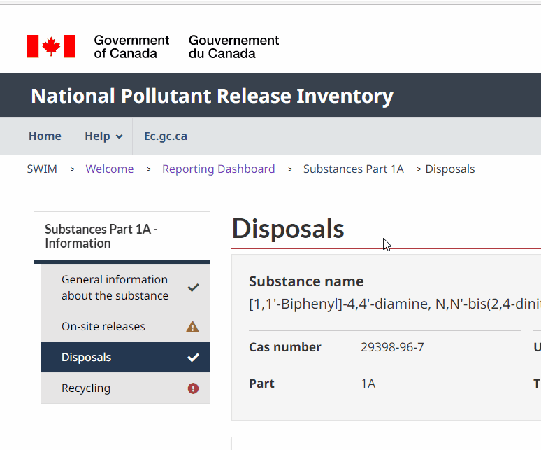</dt>
    <dt>Details</dt>
    <dd>A Menu with a header label and sub menu items that are links that sticks to the top of the page as you scroll.</dd>
    <dd>Live Example: <a href="https://lakeclearmoon.z27.web.core.windows.net/report/part_1a/part_1a_disposals.html">NPRI Link</a><dd>
</dl>

## Sticky Table of Contents

<dl>
    <dt>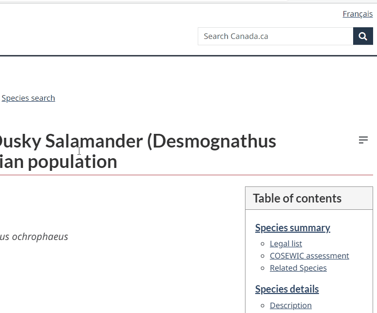</dt>
    <dd>Live Example: <a href="https://species-registry.canada.ca/index-en.html#/species/963-646">Species at Risk</a><dd>
</dl>

## Sticky Header

<dl>
    <dt>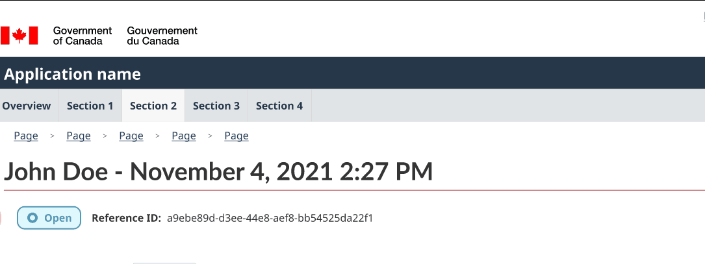</dt>
    <dt>Details</dt>
    <dd>Sticky header with customizable body (similar to how it’s implemented in GitHub issue pages).</dd>
    <dt>Live Examples</dt>
    <dd>
        <a href="https://lakeclearmoon.z27.web.core.windows.net/report/part_1a/part_1a_disposals.html">SSA Figma Link</a>
    </dd>
    <dd>
        <a href="https://github.com/ramp4-pcar4/story-ramp/issues/213">The Time Slider in the Maps blocks data on Small-Medium extents · Issue #213 · ramp4-pcar4/story-ramp (github.com)</a>
    </dd>
</dl>

## Sticky Footer

<dl>
    <dt>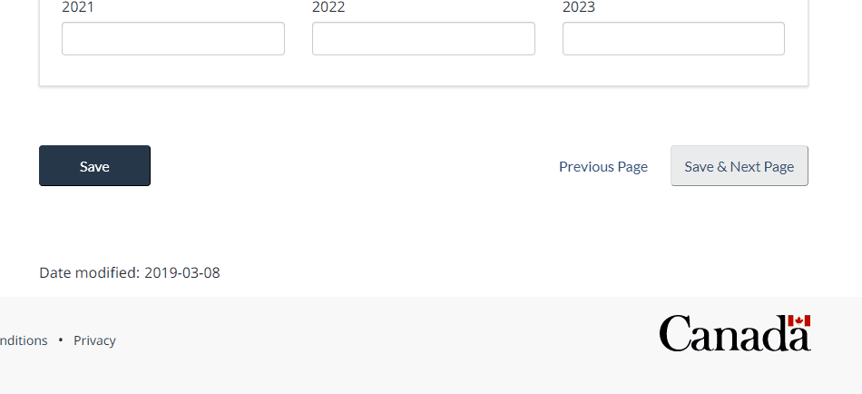</dt>
    <dt>Details</dt>
    <dd>Sticky footer with buttons for long forms that require scrolling. The sticky footer allows action buttons to be accessible at all times.</dd>
    <dt>Live Example</dt>
    <dd>
        <a href="https://lakeclearmoon.z27.web.core.windows.net/report/part_1a/part_1a_disposals.html">NPRI Link</a>
    </dd>
</dl>

## Cards

<dl>
    <dt>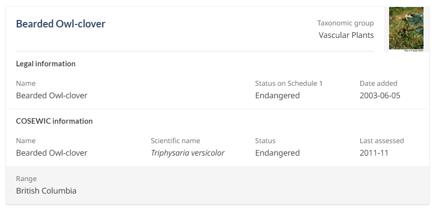</dt>
    <dt>Details</dt>
    <dd>A card is a flexible and extensible content container. It includes options for headers and footers, a wide variety of content, contextual background colors.</dd>
    <dt>Live Examples</dt>
    <dd>
        <a href="https://species-registry.canada.ca/index-en.html#/species?ranges=2,7&amp;sortBy=commonNameSort&amp;sortDirection=asc&amp;pageSize=10">Species at Risk</a>
    </dd>
    <dd>
        <a href="https://lakeclearmoon.z27.web.core.windows.net/report/part_1a/part_1a_disposals.html">Disposals - National Pollutant Release Inventory (windows.net)</a>
    </dd>
    <dd>
        <a href="https://getbootstrap.com/docs/4.0/components/card/">Cards · Bootstrap (getbootstrap.com)</a>
    </dd>
</dl>

## Dropdowns / Menus

<dl>
    <dt>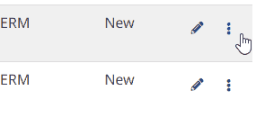</dt>
    <dt>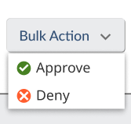</dt>
    <dt>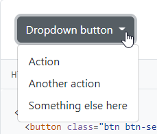</dt>
    <dt>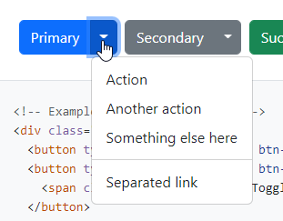</dt>
    <dt>Details</dt>
    <dd>Keyboard- and accessibility-friendly dropdowns/menus; useful for embedding into tables and having additional actions hidden from immediate view to not clutter the screen.</dd>
    <dt>Live Examples</dt>
    <dd>
        <a href="https://lakeclearmoon.z27.web.core.windows.net/reporting_dashboard.html">Reporting dashboard - National Pollutant Release Inventory (windows.net)</a>
    </dd>
    <dd>
        <a href="https://www.figma.com/file/ezbIuyTPtc0yN66BaRfGYN/SSA-wireframes-%2B-mockups?node-id=698%3A55291">https://www.figma.com/file/ezbIuyTPtc0yN66BaRfGYN/SSA-wireframes-%2B-mockups?node-id=698%3A55291</a>
    </dd>
    <dd>
        <a href="https://getbootstrap.com/docs/5.2/components/dropdowns/#single-button">Dropdowns · Bootstrap v5.2 (getbootstrap.com)</a>
    </dd>
    <dd>
        <a href="https://getbootstrap.com/docs/5.2/components/dropdowns/#split-button">Dropdowns · Bootstrap v5.2 (getbootstrap.com)</a>
    </dd>
</dl>

## Export to Excel/CSV

<dl>
    <dt>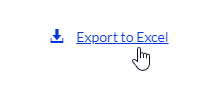</dt>
    <dt>Details</dt>
    <dd>This is more of a common functionality than a UI component: export search results (based on filters) in CSV/Excel format.</dd>
    <dt>Live Examples</dt>
    <dd>
        <a href="https://species-registry.canada.ca/index-en.html#/species?sortBy=commonNameSort&amp;sortDirection=asc&amp;pageSize=10">Species search - Species at risk registry (canada.ca)</a>
    </dd>
    <dd>
        <a href="https://environmental-protection.canada.ca/offenders-registry#:~:text=Search-,Export%20all%20records%20of%20the%20Environmental%20Offenders%20Registry,-Click%20on%20the">Environmental Offenders Registry - Canada.ca</a>
    </dd>
</dl>

## Faceted Search

<dl>
    <dt>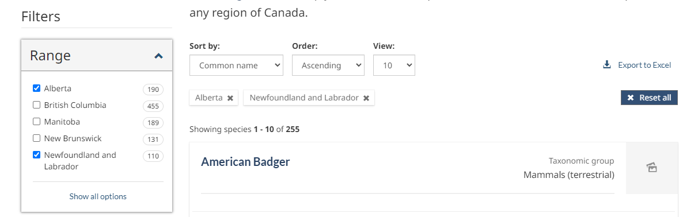</dt>
    <dt>Details</dt>
    <dd>A collapsible menu that checkboxes or radio button options for filtering through a data table or other UI components (like cards).</dd>
    <dt>Live Examples</dt>
    <dd>
        <a href="https://species-registry.canada.ca/index-en.html#/species?ranges=2,7&amp;sortBy=commonNameSort&amp;sortDirection=asc&amp;pageSize=10">Species at Risk</a>
    </dd>
</dl>

## Selected Filter Option (Pills)

<dl>
    <dt>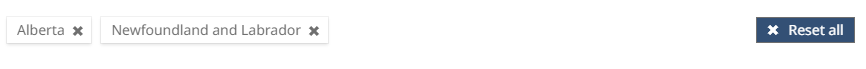</dt>
    <dt>Details</dt>
    <dd>A horizontal list of selected filter options that can be dismissed individually or can all be cleared with a button.</dd>
    <dt>Live Examples</dt>
    <dd>
        <a href="https://species-registry.canada.ca/index-en.html#/species?ranges=2,7&amp;sortBy=commonNameSort&amp;sortDirection=asc&amp;pageSize=10">Species at Risk</a>
    </dd>
</dl>

## Export to Excel/CSV

<dl>
    <dt>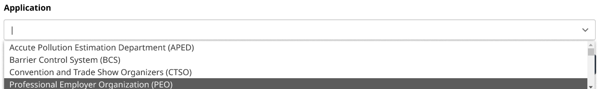</dt>
    <dt>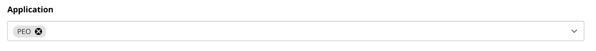</dt>
    <dt>Details</dt>
    <dd>A drop down multi select component with text input to filter down available options. Each selection appears as a pill that can be dismissed to remove the selection.</dd>
    <dt>Live Examples</dt>
    <dd>
        <a href="https://www.figma.com/proto/ezbIuyTPtc0yN66BaRfGYN/SSA-wireframes-%2B-mockups?node-id=1279%3A82050&amp;scaling=min-zoom&amp;page-id=351%3A1604&amp;starting-point-node-id=1279%3A86906&amp;show-proto-sidebar=1">Figma Link for SSA</a>
    </dd>
    <dd>
        <a href="https://choices-js.github.io/Choices/">Choices (choices-js.github.io)</a>
    </dd>
    <dd>
        <a href="https://vue-multiselect.js.org/">Vue-Multiselect | Vue Select Library</a>
    </dd>
</dl>